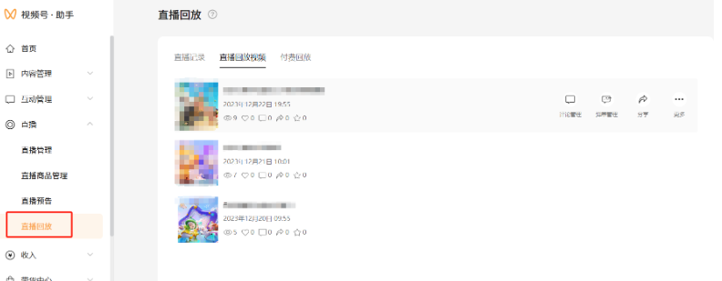
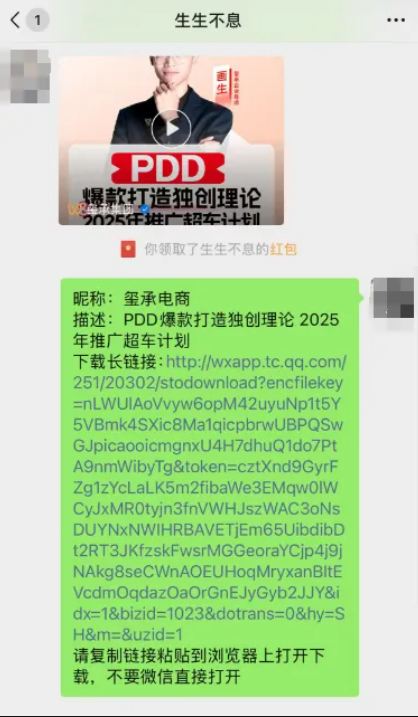

# 视频号在线直播回放下载工具，支持一键提取链接，无需登录即可下载回放视频

=近期很多朋友前来询问如何下载微信视频号直播回放，作为行业技术最强大的视频提取平台，视频号下载、视频号直播回放的下载自然可以轻松搞定。今天就说说自己经常使用的三种方法让自己快速下载视频号直播内容。

## 方法一：视频直播录制工具
关于任何时候录制/录屏都会对我们需要保存不下来的视频唯一的解决方案，不仅操作简单，使用方便，目前录屏的工具比较多，但如果你是手机用户也可以使用自身的手机录屏功能。

## 方法二：手动获取视频号直播回放地址

在视频号直播完成后系统会自动生成直播回放内容，用户可通过电脑版视频号助手进入后台，并在列表页找到直播回放，并在直播回放中找到自己直播的内容回放。

点击自己直播的内容右键点击查看源代码并复制链接地址。

## 方法三：视频号直播回放下载工具教程

在视频号直播回放下载需提前获取视频下载助手，而视频下载助手二维码是专门提供给用户下载视频号视频，但该工具可辅助用户下载视频号直播回放内容。

使用方法在手机中查看直播回放页面，点击自己需要下载的内容并转发给视频下载助手即可。

## 常见问题

### 视频号直播回放怎么下载到手机相册？
答：关于手机端下载直播回放到手机相册的推荐用户尝试使用方法三，可以直接复制链接到浏览器中下载，下载完成后可以通过文件或者手机相册查看直播回放视频。

### 视频号直播回放怎么下载到本地不用第三方软件？
答：微信官方给视频号直播作者以及直播账号所有权的用户提供了视频号直播回放下载权限，手机电脑均可保存视频号直播回放视频，并且无需使用第三方工具。

### 下载的微信视频号直播回放会过期吗？
答：根据微信官方提供的相关文档，了解到微信视频号直播回放下载具有一定的时效性，故此获取到下载地址，应该尽快保存到本地方式失效。

来源：https://www.dcyzq.com/post/3031.html
